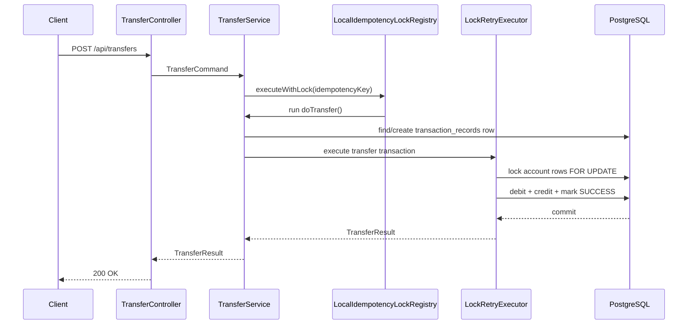

# Architecture And Design Notes

## Goal

The service implements:

```java
transfer(fromAccountId, toAccountId, amount, idempotencyKey)
```

It must:

- validate source balance
- debit source account
- credit destination account
- avoid duplicate processing
- remain safe under concurrency
- store a transaction record
- return clear success/failure responses

## Layer Responsibilities

| Layer | Responsibility |
|---|---|
| `interfaces.rest` | HTTP request/response handling, validation annotations, exception-to-HTTP mapping |
| `application` | Use-case orchestration, transaction boundaries, idempotency flow, retry policy |
| `domain` | Business objects and rules: account debit/credit, money validation, transaction status |
| `infrastructure.persistence` | Database repository interfaces and JPA locking queries |

## Request Flow



## Why `TransferRequest` Is In `interfaces.rest`

`TransferRequest` represents the HTTP JSON contract.

It contains REST concerns such as:

- `@NotNull`
- `@DecimalMin`
- `@NotBlank`
- JSON field shape

The controller maps it into `TransferCommand`, which is the application-layer use-case input.

This keeps HTTP details out of the application and domain layers.

## Idempotency Design

The client sends `idempotencyKey`.

The server:

1. Looks for an existing `transaction_records` row with that key.
2. If found, returns the existing result.
3. If not found, creates a new `PROCESSING` record.
4. Rejects the request if the same key is reused with different transfer details.

The database enforces uniqueness:

```sql
constraint uk_transaction_idempotency_key unique (idempotency_key)
```

This is the correctness boundary. Even if multiple app instances receive the same key at the same time, only one row can be created.

## Local Idempotency Lock

`LocalIdempotencyLockRegistry` is an in-memory optimization.

It serializes same-key requests inside one JVM:

```text
same idempotencyKey -> one at a time
different idempotencyKey -> can run concurrently
```

It does not replace the database uniqueness constraint because it cannot protect across multiple app instances.

## Pessimistic Account Locking

The repository method:

```java
@Lock(LockModeType.PESSIMISTIC_WRITE)
@Query("select a from Account a where a.id = :id")
Optional<Account> findByIdForUpdate(UUID id);
```

causes Hibernate/PostgreSQL to lock the selected account row.

Conceptual SQL:

```sql
select *
from accounts
where id = ?
for update;
```

This prevents concurrent writes to the same account balance while the transfer transaction is open.

## Deadlock Avoidance

The service always locks account rows in deterministic UUID order:

```java
List<UUID> lockOrder = List.of(command.fromAccountId(), command.toAccountId())
        .stream()
        .sorted(Comparator.naturalOrder())
        .toList();
```

This avoids the classic opposite-lock problem:

```text
Transfer 1: A -> B
Transfer 2: B -> A
```

Both transfers lock the smaller UUID first, then the larger UUID.

## Retry Design

`LockRetryExecutor` is separate from `TransferService.executeTransfer(...)`.

This keeps retry policy isolated from business transfer logic.

It retries:

- `CannotAcquireLockException`
- `PessimisticLockingFailureException`
- `QueryTimeoutException`

It does not retry:

- insufficient funds
- invalid transfer request
- account not found
- idempotency conflict

## Transaction Record Lifecycle

```text
PROCESSING -> SUCCESS
PROCESSING -> FAILED
```

`PROCESSING` is created in a separate transaction so the idempotency key is reserved before money movement begins.

If the transfer fails, `FAILED` is also written in a separate transaction so the failure is auditable even though debit/credit rolls back.

## Failure Scenarios

| Scenario | Result |
|---|---|
| Source account has insufficient funds | Transfer rolls back, transaction record marked `FAILED` |
| Destination account does not exist | Transfer rolls back, transaction record marked `FAILED` |
| Same idempotency key retried with same payload | Existing result returned |
| Same idempotency key retried with different payload | Request rejected |
| Database lock cannot be acquired | Retried by `LockRetryExecutor` |
| Debit succeeds but credit fails | Entire DB transaction rolls back |

## Scaling Notes

This design is safe for multiple app instances because the critical correctness mechanisms are in PostgreSQL:

- unique idempotency key constraint
- pessimistic row locks
- database transactions

The local `ReentrantLock` is only a same-JVM optimization.

For distributed microservices, the single database transaction would usually become:

- saga orchestration
- transactional outbox
- idempotent debit/credit operations per service
- eventual consistency and compensating transactions
